* Student name: Tamjid Ahsan
* Student pace: Full Time
* Scheduled project review date/time: Apr 28, 2021, 05:00 PM [DST]
* Instructor name: James Irving
* Blog post URL: TBA

# INTRODUCTION

## Overview

King County is located in the U.S. state of Washington. The population was 2,252,782 in the 2019 census estimate, making it the most populous county in Washington, and the 12th-most populous in the United States. The county seat is Seattle, also the state's most populous city. The county is named to honor civil rights leader Martin Luther King Jr.[[1]](https://en.wikipedia.org/wiki/King_County,_Washington) 

The county sees a USD 700K Median Listing Home Price, USD 431 Median Listing Home Price/Sq Ft, USD 766K Median Sold Home Price, with around 6000 homes listed for sale and 2800 homes for rent.[[2]](https://www.realtor.com/realestateandhomes-search/King-County_WA/overview) Homes in King County, WA sold for 2.19% above asking price on average in March 2021 with a median of 36 days days on market.


In March 2021, King County home prices were up 15.4% compared to last year. There were 3,198 homes sold in March 2021, up from 2,656 last year.[[3]](https://www.redfin.com/county/118/WA/King-County/housing-market).

This makes the county a prime market of real estate, and a paramount candidate for analysis. The namesake of Martin King Luther Jr. has a very lucrative real estate market worth exploring.

## Business problem

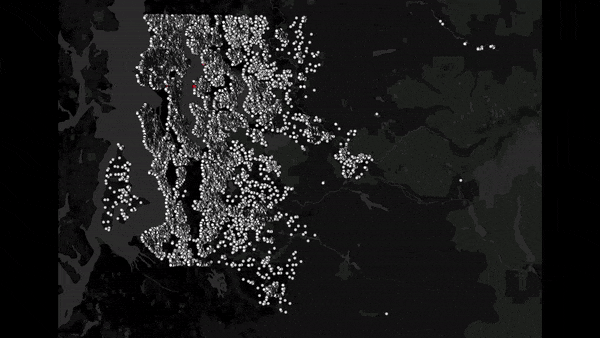
     
Source: image generated by author using tableau public, and online gif maker.

King County Residents that want to renovate their home to increase its resale value, but don't know what factors are important for determining a home's value. While focusing on features they can renovate, I shall discuss key factors of a home's price. This factors can be both under their constrain and beyond their control.

Those include:
- How to improve marketability.
- Focus on which aspect of the house.
- What factors to keep in mind deciding budget and required return on investment.

I am going to lossely follow OSEMiN framework for this analysis.
# OBTAIN

Data for this analysis was provided as part of phase two project of [The Flatiron School](https://flatironschool.com/) Full Time Online Data Science program. This a fork of [that](https://github.com/learn-co-curriculum/dsc-phase-2-project). The csv file named `kc_house_data.csv` contains following information in this repository located at `./data/kc_house_data.csv`.

GeoJson file used to get map is sourced from [here](https://github.com/OpenDataDE/State-zip-code-GeoJSON/blob/master/wa_washington_zip_codes_geo.min.json) provided by [Open Data Delaware](https://github.com/OpenDataDE/). A copy of that can be found at `./data/wa_washington_zip_codes_geo.min.json'` in this repository.

## Column Names and descriptions for Kings County Data Set

As the readme file accompanying the dataset.

* **id** - unique identified for a house
* **dateDate** - house was sold
* **pricePrice** -  is prediction target
* **bedroomsNumber** -  of Bedrooms/House
* **bathroomsNumber** -  of bathrooms/bedrooms
* **sqft_livingsquare** -  footage of the home
* **sqft_lotsquare** -  footage of the lot
* **floorsTotal** -  floors (levels) in house
* **waterfront** - House which has a view to a waterfront
* **view** - Has been viewed
* **condition** - How good the condition is ( Overall )
* **grade** - overall grade given to the housing unit, based on King County grading system
* **sqft_above** - square footage of house apart from basement
* **sqft_basement** - square footage of the basement
* **yr_built** - Built Year
* **yr_renovated** - Year when house was renovated
* **zipcode** - zip
* **lat** - Latitude coordinate
* **long** - Longitude coordinate
* **sqft_living15** - The square footage of interior housing living space for the nearest 15 neighbors
* **sqft_lot15** - The square footage of the land lots of the nearest 15 neighbors


Although explanation and data contained in **view** does not make any real life sense. It is very unlikely that so many house is sold without inspection, with keeping in mind that some folks buy houses for investment purpose, still some kind of representative visits and facilitate buying process. All other features are supportive of the explanation given and data contained with some extreme outliers, e.g. one house has 33 bedroom with an disproportionate sqft.

# SCRUB & EXPLORE

10 random sample from the dataset.
<table border="1" class="dataframe">
  <thead>
    <tr style="text-align: right;">
      <th></th>
      <th>id</th>
      <th>date</th>
      <th>price</th>
      <th>bedrooms</th>
      <th>bathrooms</th>
      <th>sqft_living</th>
      <th>sqft_lot</th>
      <th>floors</th>
      <th>waterfront</th>
      <th>view</th>
      <th>condition</th>
      <th>grade</th>
      <th>sqft_above</th>
      <th>sqft_basement</th>
      <th>yr_built</th>
      <th>yr_renovated</th>
      <th>zipcode</th>
      <th>lat</th>
      <th>long</th>
      <th>sqft_living15</th>
      <th>sqft_lot15</th>
    </tr>
  </thead>
  <tbody>
    <tr>
      <th>17535</th>
      <td>5285200020</td>
      <td>7/18/2014</td>
      <td>349950.0</td>
      <td>2</td>
      <td>1.75</td>
      <td>1640</td>
      <td>4176</td>
      <td>1.0</td>
      <td>0.0</td>
      <td>0.0</td>
      <td>4</td>
      <td>7</td>
      <td>1040</td>
      <td>600.0</td>
      <td>1948</td>
      <td>0.0</td>
      <td>98118</td>
      <td>47.5162</td>
      <td>-122.260</td>
      <td>1460</td>
      <td>5200</td>
    </tr>
    <tr>
      <th>8411</th>
      <td>1924059254</td>
      <td>5/8/2015</td>
      <td>1300000.0</td>
      <td>5</td>
      <td>3.75</td>
      <td>3490</td>
      <td>15246</td>
      <td>1.0</td>
      <td>0.0</td>
      <td>1.0</td>
      <td>4</td>
      <td>10</td>
      <td>1940</td>
      <td>1550.0</td>
      <td>1968</td>
      <td>0.0</td>
      <td>98040</td>
      <td>47.5479</td>
      <td>-122.212</td>
      <td>3410</td>
      <td>15682</td>
    </tr>
    <tr>
      <th>7393</th>
      <td>1788300020</td>
      <td>7/8/2014</td>
      <td>183500.0</td>
      <td>3</td>
      <td>1.00</td>
      <td>1040</td>
      <td>8892</td>
      <td>1.0</td>
      <td>0.0</td>
      <td>0.0</td>
      <td>4</td>
      <td>6</td>
      <td>800</td>
      <td>240.0</td>
      <td>1958</td>
      <td>0.0</td>
      <td>98023</td>
      <td>47.3273</td>
      <td>-122.349</td>
      <td>820</td>
      <td>9000</td>
    </tr>
    <tr>
      <th>582</th>
      <td>2998800125</td>
      <td>7/1/2014</td>
      <td>730000.0</td>
      <td>2</td>
      <td>2.25</td>
      <td>2130</td>
      <td>4920</td>
      <td>1.5</td>
      <td>NaN</td>
      <td>4.0</td>
      <td>4</td>
      <td>7</td>
      <td>1530</td>
      <td>600.0</td>
      <td>1941</td>
      <td>0.0</td>
      <td>98116</td>
      <td>47.5730</td>
      <td>-122.409</td>
      <td>2130</td>
      <td>4920</td>
    </tr>
    <tr>
      <th>16843</th>
      <td>6371000020</td>
      <td>11/11/2014</td>
      <td>380000.0</td>
      <td>2</td>
      <td>2.00</td>
      <td>1120</td>
      <td>780</td>
      <td>2.0</td>
      <td>0.0</td>
      <td>0.0</td>
      <td>3</td>
      <td>8</td>
      <td>760</td>
      <td>360.0</td>
      <td>2004</td>
      <td>0.0</td>
      <td>98116</td>
      <td>47.5788</td>
      <td>-122.410</td>
      <td>1120</td>
      <td>1322</td>
    </tr>
    <tr>
      <th>6076</th>
      <td>8682231330</td>
      <td>5/4/2015</td>
      <td>519000.0</td>
      <td>2</td>
      <td>2.00</td>
      <td>1560</td>
      <td>4823</td>
      <td>1.0</td>
      <td>NaN</td>
      <td>0.0</td>
      <td>3</td>
      <td>8</td>
      <td>1560</td>
      <td>0.0</td>
      <td>2004</td>
      <td>0.0</td>
      <td>98053</td>
      <td>47.7111</td>
      <td>-122.032</td>
      <td>1855</td>
      <td>4989</td>
    </tr>
    <tr>
      <th>8444</th>
      <td>6705870120</td>
      <td>7/1/2014</td>
      <td>739900.0</td>
      <td>5</td>
      <td>2.50</td>
      <td>3290</td>
      <td>5029</td>
      <td>2.0</td>
      <td>0.0</td>
      <td>0.0</td>
      <td>3</td>
      <td>8</td>
      <td>3290</td>
      <td>0.0</td>
      <td>2004</td>
      <td>0.0</td>
      <td>98075</td>
      <td>47.5773</td>
      <td>-122.056</td>
      <td>2990</td>
      <td>6441</td>
    </tr>
    <tr>
      <th>1505</th>
      <td>2214800270</td>
      <td>9/25/2014</td>
      <td>355000.0</td>
      <td>4</td>
      <td>2.50</td>
      <td>2770</td>
      <td>7000</td>
      <td>1.0</td>
      <td>0.0</td>
      <td>0.0</td>
      <td>4</td>
      <td>7</td>
      <td>1940</td>
      <td>830.0</td>
      <td>1979</td>
      <td>0.0</td>
      <td>98001</td>
      <td>47.3396</td>
      <td>-122.256</td>
      <td>2140</td>
      <td>7684</td>
    </tr>
    <tr>
      <th>3473</th>
      <td>7504010900</td>
      <td>9/26/2014</td>
      <td>598500.0</td>
      <td>3</td>
      <td>2.25</td>
      <td>2520</td>
      <td>12000</td>
      <td>1.0</td>
      <td>NaN</td>
      <td>0.0</td>
      <td>3</td>
      <td>10</td>
      <td>2520</td>
      <td>0.0</td>
      <td>1978</td>
      <td>0.0</td>
      <td>98074</td>
      <td>47.6381</td>
      <td>-122.062</td>
      <td>2510</td>
      <td>12000</td>
    </tr>
    <tr>
      <th>7576</th>
      <td>3649100306</td>
      <td>5/6/2014</td>
      <td>379900.0</td>
      <td>4</td>
      <td>1.75</td>
      <td>1500</td>
      <td>11600</td>
      <td>1.0</td>
      <td>NaN</td>
      <td>0.0</td>
      <td>4</td>
      <td>7</td>
      <td>1000</td>
      <td>500.0</td>
      <td>1955</td>
      <td>NaN</td>
      <td>98028</td>
      <td>47.7373</td>
      <td>-122.241</td>
      <td>1740</td>
      <td>11600</td>
    </tr>
  </tbody>
</table>
</div>

<br>
First I checked the data types.

<br>

    id                 int64
    date              object
    price            float64
    bedrooms           int64
    bathrooms        float64
    sqft_living        int64
    sqft_lot           int64
    floors           float64
    waterfront       float64
    view             float64
    condition          int64
    grade              int64
    sqft_above         int64
    sqft_basement     object
    yr_built           int64
    yr_renovated     float64
    zipcode            int64
    lat              float64
    long             float64
    sqft_living15      int64
    sqft_lot15         int64
    dtype: object


Observation: 
* `Date` is recognized as object, have to convert it to date-time object to be useful. 
* Why `bathroom` is a float? Upon inspection, I saw that smaller bathrooms are inputted as .5 in addition to the full sized bathrooms and .25 for even smaller ones.
* Above observation is also repeated for `floors`, smaller floors are recognized as .5 floor.
* `Waterfront` is a boolean feature, still recognized as float.
* `View` has integer value inside indicating categorical feature, still recognized as float.  
* `sqft_basement` is recognized as object. Upon inspection I found that it has some str '?' inside.

Everything else is good.

<br>
Then checked for null values:


<table border="1" class="dataframe">
  <thead>
    <tr style="text-align: right;">
      <th></th>
      <th>name</th>
      <th>is_null</th>
      <th>not_null</th>
    </tr>
  </thead>
  <tbody>
    <tr>
      <th>0</th>
      <td>id</td>
      <td>0</td>
      <td>21597</td>
    </tr>
    <tr>
      <th>1</th>
      <td>date</td>
      <td>0</td>
      <td>21597</td>
    </tr>
    <tr>
      <th>2</th>
      <td>price</td>
      <td>0</td>
      <td>21597</td>
    </tr>
    <tr>
      <th>3</th>
      <td>bedrooms</td>
      <td>0</td>
      <td>21597</td>
    </tr>
    <tr>
      <th>4</th>
      <td>bathrooms</td>
      <td>0</td>
      <td>21597</td>
    </tr>
    <tr>
      <th>5</th>
      <td>sqft_living</td>
      <td>0</td>
      <td>21597</td>
    </tr>
    <tr>
      <th>6</th>
      <td>sqft_lot</td>
      <td>0</td>
      <td>21597</td>
    </tr>
    <tr>
      <th>7</th>
      <td>floors</td>
      <td>0</td>
      <td>21597</td>
    </tr>
    <tr>
      <th>8</th>
      <td>waterfront</td>
      <td>2376</td>
      <td>19221</td>
    </tr>
    <tr>
      <th>9</th>
      <td>view</td>
      <td>63</td>
      <td>21534</td>
    </tr>
    <tr>
      <th>10</th>
      <td>condition</td>
      <td>0</td>
      <td>21597</td>
    </tr>
    <tr>
      <th>11</th>
      <td>grade</td>
      <td>0</td>
      <td>21597</td>
    </tr>
    <tr>
      <th>12</th>
      <td>sqft_above</td>
      <td>0</td>
      <td>21597</td>
    </tr>
    <tr>
      <th>13</th>
      <td>sqft_basement</td>
      <td>0</td>
      <td>21597</td>
    </tr>
    <tr>
      <th>14</th>
      <td>yr_built</td>
      <td>0</td>
      <td>21597</td>
    </tr>
    <tr>
      <th>15</th>
      <td>yr_renovated</td>
      <td>3842</td>
      <td>17755</td>
    </tr>
    <tr>
      <th>16</th>
      <td>zipcode</td>
      <td>0</td>
      <td>21597</td>
    </tr>
    <tr>
      <th>17</th>
      <td>lat</td>
      <td>0</td>
      <td>21597</td>
    </tr>
    <tr>
      <th>18</th>
      <td>long</td>
      <td>0</td>
      <td>21597</td>
    </tr>
    <tr>
      <th>19</th>
      <td>sqft_living15</td>
      <td>0</td>
      <td>21597</td>
    </tr>
    <tr>
      <th>20</th>
      <td>sqft_lot15</td>
      <td>0</td>
      <td>21597</td>
    </tr>
  </tbody>
</table>
</div>


Found some `NaN` values in, with my reasoning why it might be like this:
* `waterfront`: missing data.
* `view`: missing data.
* `yr_renovated`: missing data, or it was never renovated?

<br>
Next comes duplicate check.
<br>

<table border="1" class="dataframe">
  <thead>
    <tr style="text-align: right;">
      <th></th>
      <th>name</th>
      <th>duplicated</th>
      <th>not_duplicated</th>
    </tr>
  </thead>
  <tbody>
    <tr>
      <th>0</th>
      <td>id</td>
      <td>177</td>
      <td>21420</td>
    </tr>
    <tr>
      <th>1</th>
      <td>date</td>
      <td>21225</td>
      <td>372</td>
    </tr>
    <tr>
      <th>2</th>
      <td>price</td>
      <td>17975</td>
      <td>3622</td>
    </tr>
    <tr>
      <th>3</th>
      <td>bedrooms</td>
      <td>21585</td>
      <td>12</td>
    </tr>
    <tr>
      <th>4</th>
      <td>bathrooms</td>
      <td>21568</td>
      <td>29</td>
    </tr>
    <tr>
      <th>5</th>
      <td>sqft_living</td>
      <td>20563</td>
      <td>1034</td>
    </tr>
    <tr>
      <th>6</th>
      <td>sqft_lot</td>
      <td>11821</td>
      <td>9776</td>
    </tr>
    <tr>
      <th>7</th>
      <td>floors</td>
      <td>21591</td>
      <td>6</td>
    </tr>
    <tr>
      <th>8</th>
      <td>waterfront</td>
      <td>21594</td>
      <td>3</td>
    </tr>
    <tr>
      <th>9</th>
      <td>view</td>
      <td>21591</td>
      <td>6</td>
    </tr>
    <tr>
      <th>10</th>
      <td>condition</td>
      <td>21592</td>
      <td>5</td>
    </tr>
    <tr>
      <th>11</th>
      <td>grade</td>
      <td>21586</td>
      <td>11</td>
    </tr>
    <tr>
      <th>12</th>
      <td>sqft_above</td>
      <td>20655</td>
      <td>942</td>
    </tr>
    <tr>
      <th>13</th>
      <td>sqft_basement</td>
      <td>21293</td>
      <td>304</td>
    </tr>
    <tr>
      <th>14</th>
      <td>yr_built</td>
      <td>21481</td>
      <td>116</td>
    </tr>
    <tr>
      <th>15</th>
      <td>yr_renovated</td>
      <td>21526</td>
      <td>71</td>
    </tr>
    <tr>
      <th>16</th>
      <td>zipcode</td>
      <td>21527</td>
      <td>70</td>
    </tr>
    <tr>
      <th>17</th>
      <td>lat</td>
      <td>16564</td>
      <td>5033</td>
    </tr>
    <tr>
      <th>18</th>
      <td>long</td>
      <td>20846</td>
      <td>751</td>
    </tr>
    <tr>
      <th>19</th>
      <td>sqft_living15</td>
      <td>20820</td>
      <td>777</td>
    </tr>
    <tr>
      <th>20</th>
      <td>sqft_lot15</td>
      <td>12915</td>
      <td>8682</td>
    </tr>
  </tbody>
</table>
</div>


Here are my observation:

<br>

| feature       | duplicated | not duplicated | Observation                                         |
|---------------|------------|----------------|-----------------------------------------------------|
| id            | 177        | 21420          | possible duplication. inspect it further to comment |
| date          | 21225      | 372            |                                                     |
| price         | 17975      | 3622           | indicates continuous feature                       |
| bedrooms      | 21585      | 12             | indicates categorical feature                       |
| bathrooms     | 21568      | 29             | indicates categorical feature                       |
| sqft_living   | 20563      | 1034           | indicates continuous feature                       |
| sqft_lot      | 11821      | 9776           | indicates continuous feature                       |
| floors        | 21591      | 6              | indicates categorical feature                       |
| waterfront    | 21594      | 3              | indicates categorical feature                       |
| view          | 21591      | 6              | indicates categorical feature                       |
| condition     | 21592      | 5              | indicates categorical feature                       |
| grade         | 21586      | 11             | indicates categorical feature                       |
| sqft_above    | 20655      | 942            | indicates continuous feature                       |
| sqft_basement | 21293      | 304            | indicates continuous feature                       |
| yr_built      | 21481      | 116            | indicates continuous feature                       |
| yr_renovated  | 21526      | 71             |                                                     |
| zipcode       | 21527      | 70             | dataset contains data of 70 zipcodes                |
| lat           | 16564      | 5033           | this is location info                               |
| long          | 20846      | 751            | this is location info                               |
| sqft_living15 | 20820      | 777            | indicates continuous feature                       |
| sqft_lot15    | 12915      | 8682           | indicates continuous feature                       |


Then inspected `id` column and found out that, Some houses were sold more than one time, hence the duplication.


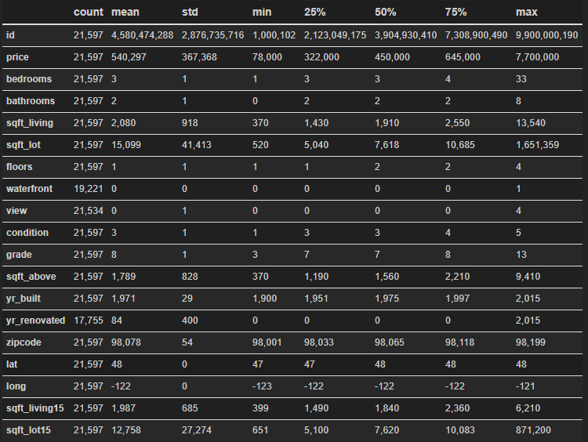

By looking at the mean, mod, and quantiles found nothing that contradicts my previous observations. Got some sense of the distribution by looking min and max. For example, price observations are widely distributed, so are all the sqft features. 

Observed unusual max in bedrooms, have to isolate and observe this in the next cell.

<table border="1" class="dataframe">
  <thead>
    <tr style="text-align: right;">
      <th></th>
      <th>id</th>
      <th>date</th>
      <th>price</th>
      <th>bedrooms</th>
      <th>bathrooms</th>
      <th>sqft_living</th>
      <th>sqft_lot</th>
      <th>floors</th>
      <th>waterfront</th>
      <th>view</th>
      <th>condition</th>
      <th>grade</th>
      <th>sqft_above</th>
      <th>sqft_basement</th>
      <th>yr_built</th>
      <th>yr_renovated</th>
      <th>zipcode</th>
      <th>lat</th>
      <th>long</th>
      <th>sqft_living15</th>
      <th>sqft_lot15</th>
    </tr>
  </thead>
  <tbody>
    <tr>
      <th>15856</th>
      <td>2402100895</td>
      <td>6/25/2014</td>
      <td>640000.0</td>
      <td>33</td>
      <td>1.75</td>
      <td>1620</td>
      <td>6000</td>
      <td>1.0</td>
      <td>0.0</td>
      <td>0.0</td>
      <td>5</td>
      <td>7</td>
      <td>1040</td>
      <td>580.0</td>
      <td>1947</td>
      <td>0.0</td>
      <td>98103</td>
      <td>47.6878</td>
      <td>-122.331</td>
      <td>1330</td>
      <td>4700</td>
    </tr>
  </tbody>
</table>
</div>


Observation: Count of bedrooms does not make sense with respect of bathrooms of 1.75; and living and lot size of 1620 and 6000; also sqft above. Indicates a erroneous input.

## Initial cleaning


 Dropped duplicates from `id` feature, keeping first:
 
 I could also have kept those by looking into them individually to make sure there is no actual duplicate values.
 As the data loss is not significant, I am dropping this keeping the first occurrence. Also could have kept the data based on last sale date,
 which requires additional work, filtering based on date  and other features like price; and then dropping it. Not venturing that path for this analysis.

Next:
 * Converted `date` to datetime dtype
 * Replaced missing (Nan and "?") rows to 0 in `waterfront`, `view`, `yr_renovated`, `sqft_basement`.
 
 My reasoning for filling with 0 is that, it is relatively safe to assume that the house does not have waterfront, was not renovated and does not have basement. Alternatively I could have simply dropped those from the dataset. Filling with mean or mode has the same drawback as filling with 0 because of the pattern of missing values, so I filled in with 0.
 
 Then I dropped a row where bedroom was 33. It is clearly a mistake in data entry, as it does not match with the sqft of that house. Could have filled that to 3, but did not do so as the data loss is negligible. 

My reasoning for filling with 0 is that, it is relatively safe to assume that the house does not have waterfront, was not renovated and does not have basement. Alternatively I could have simply dropped those from the dataset. Filling with mean or mode has the same drawback as filling with 0 because of the pattern of missing values, so I filled in with 0.

Then I dropped a row where bedroom was 33. It is clearly a mistake in data entry, as it does not match with the sqft of that house. Could have filled that to 3, but did not do so as the data loss is negligible.


After this, no `NaN`, duplicates remain in the dataset. Possible error from `bedrooms` has been dropped.

## Feature engineering

### Price per sqft

Ratio of price of each house over total sqft of that.


### Neighborhood

Created a boolean feature to check that Total sqft of a house is within 40% to 60% range of average of total sqft of surrounding 15 house to detect unusual house in the neighborhood. This is a check for unusual homes.


### Is Renovated

Out of 21419 values, 20679 are empty while only 740 rows containing year renovated. This is not usefull for the model. So this feature is converted to a boolean, where 1 means it is renovated and 0 means it not renovated.

## First look at the cleaned dataset


### Checked the distribution

    
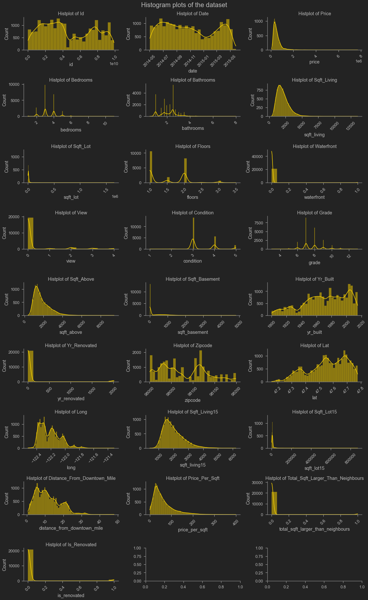
    


| Feature                           | Observation                                                                                                                     |
|-----------------------------------|---------------------------------------------------------------------------------------------------------------------------------|
|  bathrooms                        | High density between 1 to 4                                                                                                     |
|  bedrooms                         | High density between 2 to 4                                                                                                     |
|  condition                        | Majority falls under 3 category                                                                                                 |
|  date                             | Sale was fairly consistant                                                                                                      |
|  floors                           | Most of the house are either 1 or 2 storey                                                                                      |
|  grade                            | High density between 6 to 10                                                                                                    |
|  is_renovated                     | Most of the house were never renovated                                                                                          |
|  long                             | Should not make sense as this is just numbers representating   location                                                         |
|  price                            | Very high distribution with a lot of outliers                                                                                   |
|  price_per_sqft                   | Almost normal looking except a very long right tail, starting at around   $180                                                  |
|  sqft_basement                    | Most of the house does not have a finished basement                                                                             |
|  sqft_living                      | Almost normal looking except a very long right tail, starting at around   5000                                                  |
|  sqft_living15                    | Almost normal looking except a very long right tail, starting at around   4000                                                  |
|  sqft_lot15                       | Consists of very large outliers                                                                                                 |
|  view                             | Most of the value has 0 views                                                                                                   |
|  waterfront                       | Most of the house does not have watefront                                                                                       |
|  yr_built                         | House building is fairly consistant, except few periods when there were   nationwide economic crisis. (See Price VS year built) |
|  yr_renovated                     |                                                                                                                                 |
|  zipcode                          | Varying frequency of sale observed among the zipcodes                                                                           |
| distance_from_downtown_mile       | Most of the house falls under 25 miles                                                                                          |
| id                                | Should not make sense as this is just numbers representating   house id                                                         |
| lat                               | Should not make sense as this is just numbers representating   location                                                         |
| sqft_above                        | Almost normal looking except a very long right tail, starting at around   4000                                                  |
| sqft_lot                          | Outliers have very large value                                                                                                  |
| total_sqft_larger_than_neighbours | Very few house are outliers as defined previously                                                                               |


This plot helped be to better understand the data. Outliers will be dealt with more vigorously in the later part of the analysis.
## Categorical and Numerical  features

### Identifying
based on information from the readme file attached to the dataset.
```python
# House identifier
unique_feat_df = ['id']

# Catagorical features
categorical_feat_df = ['waterfront', 'view', 'condition', 'grade', 'is_renovated']

# Numeric features
numerical_continuous_feat_df = [
    'price', 'sqft_living', 'sqft_lot', 'sqft_above', 'sqft_basement',
    'sqft_living15', 'sqft_lot15', 'price_per_sqft',
    'distance_from_downtown_mile', 'total_sqft_larger_than_neighbours',
    'price_per_sqft']

numerical_discrete_feat_df = ['bedrooms', 'bathrooms', 'floors']

# Timing features
time_feat_df = ['date', 'yr_built', 'yr_renovated']

# Location feat
location_feat_df = ['lat', 'long', 'zipcode']
```


### Dropping

In the Dataframe for initial model `id`, `date`, `yr_renovated`, and `view` is not included. My reasoning for this is following:
- `id`: This is the identifier column.
- `date`: Sale date is not important input for now as I am not capturing seasonality of value for this analysis.
- `yr_renovated`: Already converted to boolean column.
- `view`: Not sure about this feature what it really means as not much information is provided. This can also be a categorical or numeric feature.

## Feature relationships

### Feature correlation and multicollinearity 


### Heatmap


Here is a heat map of correlation.


    

    


Observed some interesting relationship among features. Few highlights are:
* Distance has a negative relationship with price.
* sqft_living and sqft_above is positively correlated with grade.
* sqft_living is highly positively correlated with price and bathrooms.
* sqft_above and sqft_living, grade and sqft_living clearly has collinearity issue.
* sqft_above and grade, sqft_living and sqft_living15, bathrooms and sqft_living are just crossing the .75 mark.

Leaving collinear features it as it is right now. Will drop this later.

### View - what is it?

    
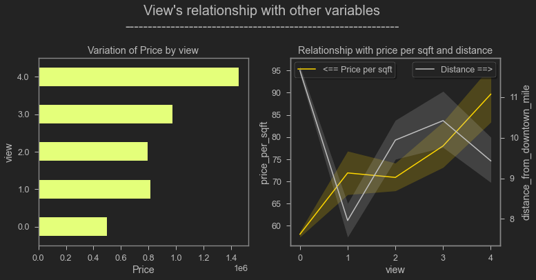
    


    
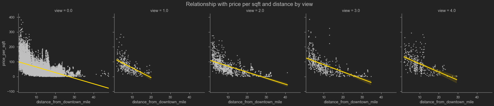
    
    


Now I tried to make sense of `"view"`. It seems like it detects the aesthetic quality of the house. Not sure if it is something that a owner can manipulate, e.g. architectural design or landscaping and decoration; or its is natural, e.g. close to a park or view from window.

Higher rated house has the greatest average price. This trend is very clear.

It seems that houses closer to the downtown has a higher price per sqft but lower view as the city landscape is not pristine but proximity to business center makes them desirable. But at the next category price drops as distance increases, people are not shelling coins for sub-par property. When the distance is high means we are out of downtown with less congested area where view is better, thus increase in price. Then at the last one we are at the suburbs, where price sees a drop because of distance.

This feature is still sufficiently ambiguous to present to the public, I might be interpreting this from a myopic view and got entirely wrong. 


### Paired Feature exploration

### Price VS Year Built

    
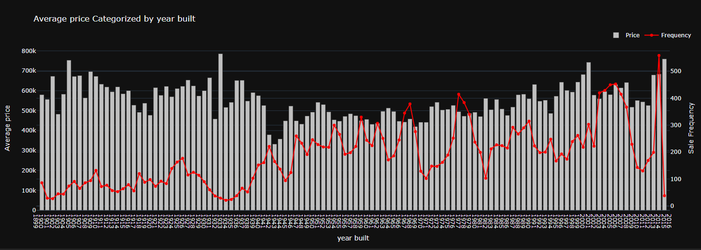
    


Hoses built in the 40's to 60's have good value. A weird situation for the beginning of 70's, maybe related to a quirk of the dataset or energy crisis of that time, more domain research is needed to comment on that. High sale frequency in the early 00's to a dip in 2008 because of the global financial crisis because of subprime mortgage situation. House prices was in a bubble that created the financial crisis. This data also supports that. This data of house price and sale coincides with all financial crisis. But across the board house price is stable. Have to look into sale date to make any further comment.


### Paired Feature exploration

#### Price VS Bedroom Count

    
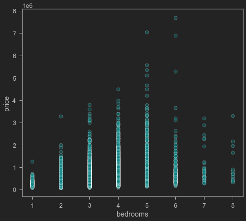    
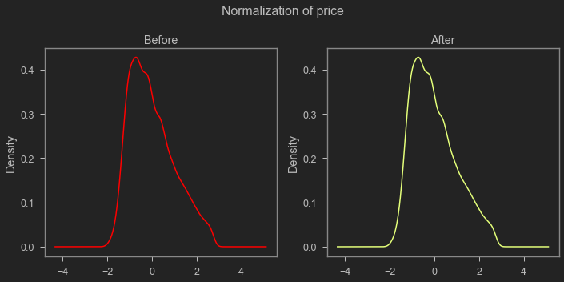
    
I can spot a pattern reversal after bedroom count 5. Increased bedroom count has a diminishing return after a certain thresh hold, which is 5 after that reg line flattens or include error. Another point that I noticed is that, one bedrooms has a very flat line. So Anything better than one bedroom adds value to the house. 

Although more house with more bedroom has higher average sale price, this is because they are usually a larger property. I could bin house size and go down that path to pin point that, but not choosing not to for the sake of time constraint.

#### Price VS Distance from downtown
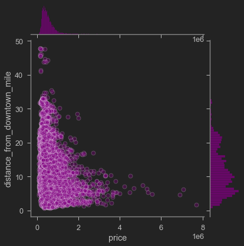
    


This is a no-brainer, that house closest to the city center has a higher value. This chart helped me to spot some outliers. Later confirmed by looking at the map. Making a cap of arbitrary 40 miles cap there guided by looking at the above plot. I found 18 outliers.

I shall remove this from the dataset in later step where I remove outliers.

### Location

#### House Location


    
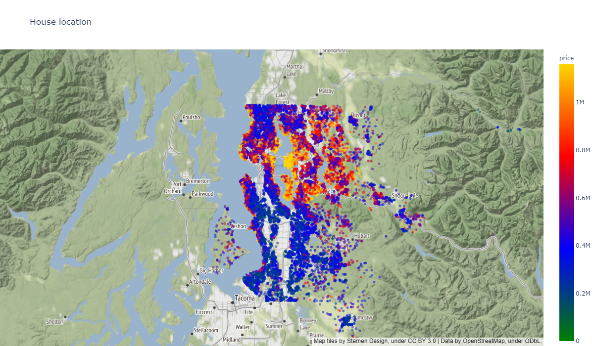
    


Most expensive houses are centered around downtown Seattle.


#### Average Price by Zipcode


    
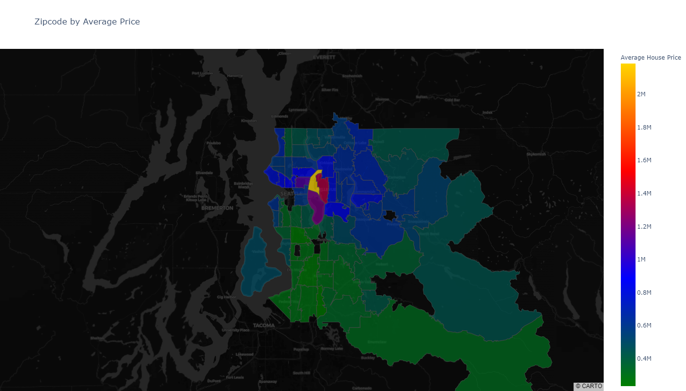
    


Not all zipcodes have similar value. This makes zipcode a important feature to select in the model for regression.
    
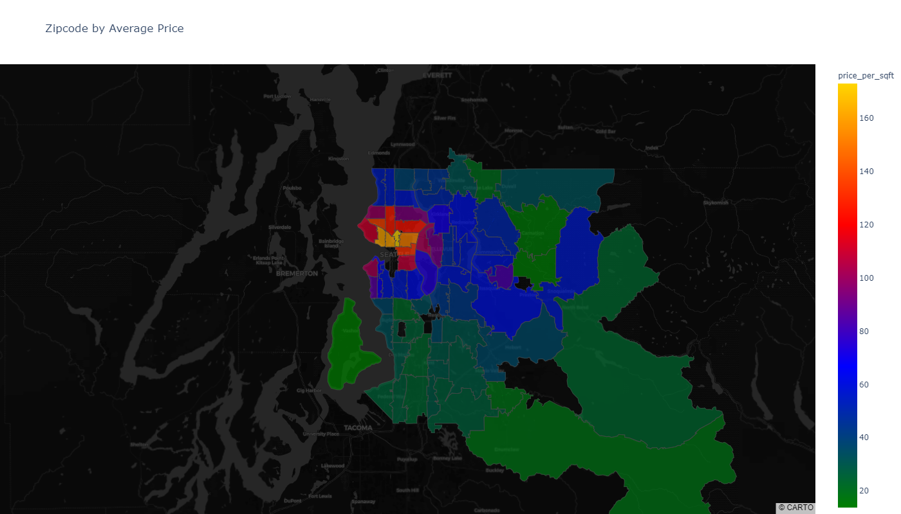
    

This is just a continuation of previous map. Here I used price per sqft instead of the price of the home in total to make sure that bigger house does not mess with the numbers. Now all the houses are in the same scale. This also set a bar on what price to expect when selling.


### Outlier Removal
Then I decided to check the performance of IQR based and Z score based outlier removal. Based on the shape of result it seemed that IQR based removal is more appropriate here.

From the chart potential candidate for formula based outlier removal are:
- price
- bathrooms
- bathrooms
- sqft_living
- sqft_lot
- floors
- condition
- sqft_above
- sqft_basement

And for manual outlier removal: 
- distance_from_downtown_mile


One sample of that process


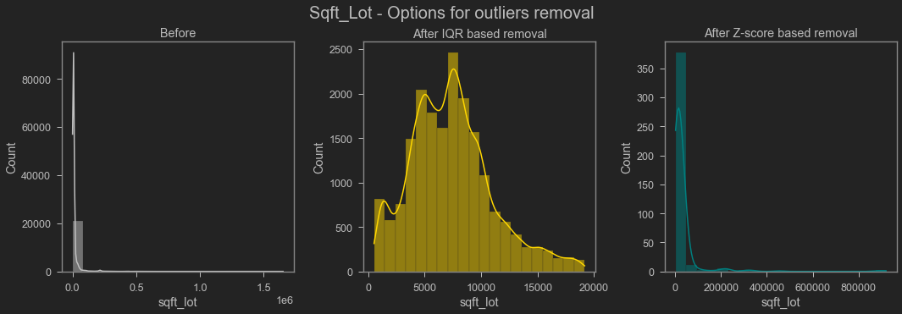

    


Across the board outlier removal by using IQR is the winner. Stats for that is:


    Dropping data
    ________________________________________________________________________________________________________________________________________________________________
    Price
      Data dropped: 1151
      Data loss : 5.3737%
    Bathrooms
      Data dropped: 99
      Data loss : 0.4885%
    Sqft_living
      Data dropped: 272
      Data loss : 1.3486%
    Sqft_lot
      Data dropped: 2089
      Data loss : 10.4991%
    Floors
      Data dropped: 0
      Data loss : 0.0%
    Condition
      Data dropped: 20
      Data loss : 0.1123%
    Sqft_above
      Data dropped: 449
      Data loss : 2.5242%
    Sqft_basement
      Data dropped: 359
      Data loss : 2.0705%
    ________________________________________________________________________________________________________________________________________________________________
    
    New outlier removed dataset length: 16980
    Old dataset length: 21419
    Total data loss: 23.22%
    

There are few extremely big values in distance_from_downtown feature, which were removed. Thresh hold for this is that houses with distance of more than 40 miles were dropped. There were 18 outliers. So the final dataset size is 19975.


## Ordinary Least Squares Regression

I used this function for majority of my regression analysis.
```python
def OLS_sm(df,
           dependant_var='price',
           numeric_features=[],
           categorical_features=[],
           verbose=False,
           show_summary=True,
           show_plots=True,
           target_is_dollar=False):
    """
    ### Uses formula based statsmodels regression for OLS. ###
    
    Displays a statsmodels.iolib.summary.Summary object containing summary of OLS analysis. 
    Returns a statsmodels.regression.linear_model.RegressionResultsWrapper which can be used to access other options available.

    Parameters:
    ===========
        df = pandas.DataFrame; no default. 
                Input dataset to use for OLS.
        dependant_var = str; default: 'price'. 
                Dependent variable.
        numeric_features = list; default = []. 
                Identify numeric features.
        categorical_features = list; default = []. 
                Identify categorical features.
        verbose = boolean; default: False. 
                Shows the formula used and drop information.
                    `True` shows information.
                    `False` does not show information.
        show_summary = boolean; default: False. 
                Shows summary report.
                    `True` shows information.
                    `False` does not show information.
        show_plots = boolean; default: True. 
                Shows summary and Homoscedasticity information.
                    `True` shows information.
                    `False` does not show information.
        target_is_dollar = boolean; default: True. 
                Modify chart axis label.
                    `True` modify information.
                    `False` does not modify information.    
    Under-The-Hood:
    ===============
    --{Major Steps}--
        
        ## Regression
        cate = ' + '.join([f'C({x})' for x in categorical_features])
        nume = ' + '.join([f'{x}' for x in numeric_features])
        formula = f'{dependant_var} ~ {nume} + {cate}'
        multiple_regression = smf.ols(formula=formula, data=df).fit()
        
        ## plots
        # plot on the left
        sm.qqplot(multiple_regression.resid,
                  dist=stats.norm,
                  line='45',
                  fit=True,
                  ax=ax1)
        # plot on the right
        ax2.scatter(x=multiple_regression.fittedvalues,
                    y=multiple_regression.resid,
                    s=4,
                    color='gold')
    
    Note:
    =====
        Make sure that every column in the DataFrame has the correct dtype.
        Numeric values stored as str (i.e, object) will make stats model assume that those are categorical variable.
        If Erros, check df to see if the passed feature is available in the DataFrame.
    
    Issues:
    -------
        - Output control is not clear.
    
    Changelog:
    ----------
        - changed `resid`, was using `resid_pearson`.
        - docstring update.
    
    Next Step: 
    ----------
        - Add isolated high p_vals output based on thresh hold with verbosity display control.
    
    -- ver: 1.3.1 --
    """
    cate = ' + '.join([f'C({x})' for x in categorical_features])
    nume = ' + '.join([f'{x}' for x in numeric_features])
    if len(cate)==0:
        formula = f'{dependant_var} ~ {nume}'
    else:
        formula = f'{dependant_var} ~ {nume} + {cate}'
    print('Formula for the OLS model: ', formula)
    # OLS regressor
    multiple_regression = smf.ols(formula=formula, data=df).fit()

    if verbose:
        show_summary = True
        show_plots = True

    if show_summary:
        display(multiple_regression.summary())
    if show_plots:
        # plotting
        # plot 1
        fig, (ax1,
              ax2) = plt.subplots(ncols=2,
                                  figsize=(10, 5),
                                  gridspec_kw={'width_ratios': [0.6, 0.4]})
        sm.qqplot(multiple_regression.resid,
                  dist=stats.norm,
                  line='45',
                  fit=True,
                  ax=ax1)
        ax1.set_title('Q-Q Plot', fontdict={"size": 15})
        # plot 2
        # uses The predicted values for the original (unwhitened) design.
        ax2.scatter(x=multiple_regression.fittedvalues, 
                    y=multiple_regression.resid,
                    s=4,
                    color='gold')
        if target_is_dollar:
            ax2.yaxis.set_major_formatter(format_number)
        ax2.set(xlabel='Predicted', ylabel='Residuals')
        ax2.axhline(y=0, c='r', lw=4, ls='--')
        ax2.set_title('Predicted VS Residuals', fontdict={"size": 15})
        plt.suptitle('Visual Check of Residuals for Homoscedasticity',
                     ha='center',
                     va='bottom',
                     fontdict={"size": 25})
        plt.tight_layout()
    if verbose == False and show_summary == False and show_plots == True:
        print('r_sq:', round(multiple_regression.rsquared, 4))
    return multiple_regression
```


> With outliers dropped data


    Formula for the OLS model:  price ~ bedrooms + bathrooms + sqft_living + sqft_lot + floors + sqft_above + sqft_basement + yr_built + lat + long + sqft_living15 + sqft_lot15 + distance_from_downtown_mile + price_per_sqft + C(waterfront) + C(condition) + C(grade) + C(is_renovated) + C(zipcode) + C(total_sqft_larger_than_neighbours)
    r_sq: 0.8654
 


    
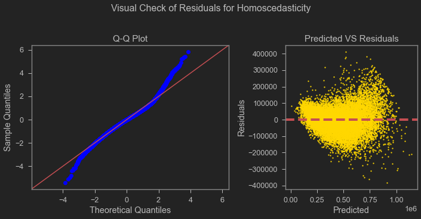
    


With outlier removed data r squared is saw a improvement to very high score of 0.8654. Still there are 6 features with high p value in the model, those are  grade, bedrooms, zipcodes, sqft basement, lat and long; and the residual plot still fails homoscedasticity test although a bit better than the previous one. Compared to the previous model condition now does not have a significant p value, bedroom takes its place with much more larger p value of .55 compared to condition having .08 in the previous model.

Overall, not a good model, but heading towards the right direction.

### Consider the above one as base model

It has 6 features with high p value, and residual plots are abnormal indicating that they are not normally distributed. To tackle this issue I shall try scaling the data to see is there any room for improvement available.


## Check for multicolinerity


    
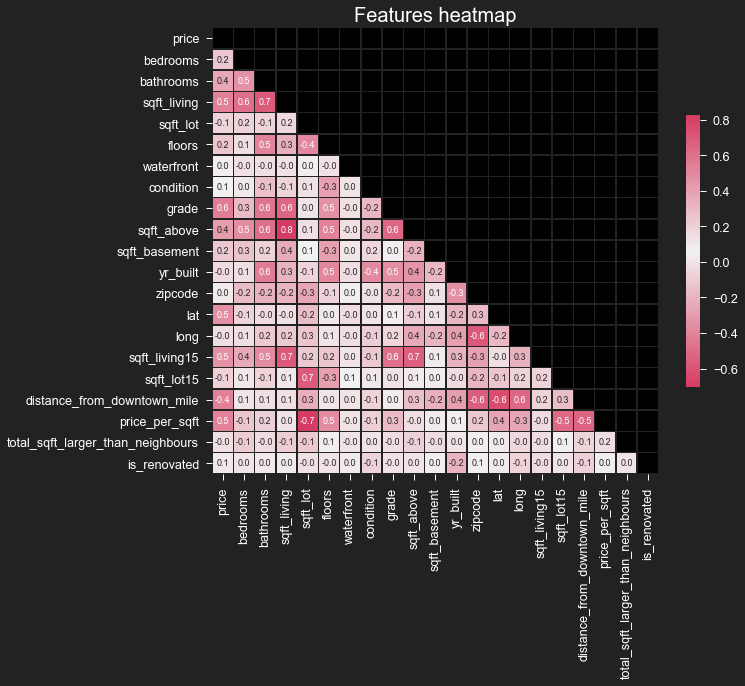
    


I can spot some features with high collinearity. In next cell I have them spelled out. 


    Positive correlations:
       index                         feature_combo  correlation
    0     72            sqft_above and sqft_living     0.828983
    1     78         sqft_living15 and sqft_living     0.701438
    2    100               sqft_lot and sqft_lot15     0.694961
    3     45             bathrooms and sqft_living     0.693803
    4    204          sqft_above and sqft_living15     0.676662
    5    324          sqft_living15 and sqft_above     0.676662
    6    177                  sqft_above and grade     0.647676
    7     71                 sqft_living and grade     0.644038
    8    311  distance_from_downtown_mile and long     0.639891
    9     24              sqft_living and bedrooms     0.613042
    
    ----------------------------------------------------------------------
    Negative correlations:
       index                                   feature_combo  correlation
    0    102                     sqft_lot and price_per_sqft    -0.702066
    1    290             distance_from_downtown_mile and lat    -0.633190
    2    266                                long and zipcode    -0.580954
    3    269         distance_from_downtown_mile and zipcode    -0.558346
    4    375  distance_from_downtown_mile and price_per_sqft    -0.528996
    5    354                   price_per_sqft and sqft_lot15    -0.506349
    6     17           distance_from_downtown_mile and price    -0.413736
    7     89                             sqft_lot and floors    -0.380494
    8    158                          yr_built and condition    -0.369611
    9    243                            yr_built and zipcode    -0.344854
    

* `sqft_above and sqft_living` is beyond .75.
* `sqft_living15 and sqft_living`, and `price_per_sqft and sqft_lot` is around .70. 


Now setting my thresh hold at .75 to drop feature. Decided to drop `sqft_above` from the data set.


### Dropping feature

Dropping `sqft_above` from the data set. also dropping redundant location feature `lat` and `long`. And for `price_per_sqft`, I dropped it, after getting impact of this on the model. 


```python
# list of features for throw away models
categorical_feat_ = ['waterfront', 'condition', 'grade']
numeric_feat = [
    'bedrooms', 'bathrooms', 'sqft_living', 'sqft_lot', 'floors',
    'sqft_basement', 'yr_built', 'sqft_living15', 'sqft_lot15',
    'distance_from_downtown_mile', 'total_sqft_larger_than_neighbours',
    'is_renovated'
]
```

> throwaway model, sans `price_per_sqft`


    Formula for the OLS model:  price ~ bedrooms + bathrooms + sqft_living + sqft_lot + floors + sqft_basement + yr_built + sqft_living15 + sqft_lot15 + distance_from_downtown_mile + total_sqft_larger_than_neighbours + is_renovated + C(waterfront) + C(condition) + C(grade)
    r_sq: 0.6519
    


    
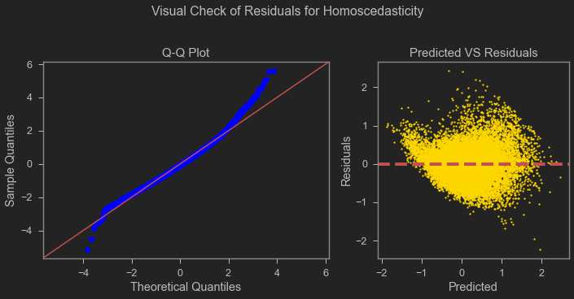
    


> throwaway model with `price_per_sqft`


    Formula for the OLS model:  price ~ bedrooms + bathrooms + sqft_living + sqft_lot + floors + sqft_basement + yr_built + sqft_living15 + sqft_lot15 + distance_from_downtown_mile + total_sqft_larger_than_neighbours + is_renovated + price_per_sqft + C(waterfront) + C(condition) + C(grade)
    r_sq: 0.7941
    


    
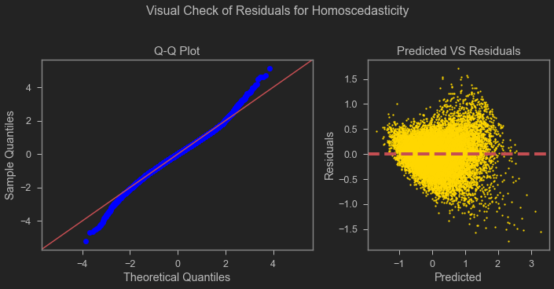
    


By comparing those two throw away models I can spot `price_per_sqft` is leaking information (by looking at the r sq difference of almost .15, although the residual plot looks a little better), as it was derived from the target.

I am not comfortable to leave this in the model, thus dropping it for now.


    Positive correlations:
       index                  feature_combo  correlation
    0     63  sqft_living15 and sqft_living     0.701438
    1     81        sqft_lot and sqft_lot15     0.694961
    2     37      bathrooms and sqft_living     0.693803
    3     59          sqft_living and grade     0.644038
    4     20       sqft_living and bedrooms     0.613042
    5    148        sqft_living15 and grade     0.605869
    6     42            bathrooms and grade     0.584765
    7      8                price and grade     0.559627
    8     44         yr_built and bathrooms     0.551460
    9      3          price and sqft_living     0.540199
    
    ----------------------------------------------------------------------
    Negative correlations:
       index                            feature_combo  correlation
    0    201  distance_from_downtown_mile and zipcode    -0.558346
    1     14    distance_from_downtown_mile and price    -0.413736
    2     73                      sqft_lot and floors    -0.380494
    3    129                   yr_built and condition    -0.369611
    4    181                     yr_built and zipcode    -0.344854
    5     94                 sqft_basement and floors    -0.287901
    6     98                    floors and sqft_lot15    -0.287411
    7    199                sqft_living15 and zipcode    -0.282860
    8     92                     floors and condition    -0.282272
    9     79                     sqft_lot and zipcode    -0.254264
    

No multicollinear feature remains based on a threshold of .75.

# MODEL

## Feature Selection

### Exploratory Simple  OLS a.k.a. Univariate OLS or ANNOVA 

On all data

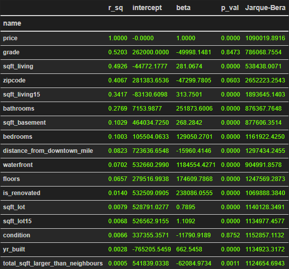


This can be somewhat helpful for selecting features. This is not a foolproof way of selecting features as this does not capture the combined power of features for explanation, this is not even the preffered way. This can be used to come up with a preliminary model and iterate upon it.

`price` has perfect relationship with except and can explain it fully, this is very much expected. rest of the features are of interest.
* `grade`, `sqft_living`, `zipcode` have very good explaining power. Should be present in the model.
* `sqft_above`, `sqft_living15`, `bathrooms` comes next.
* rest of them are also important but not as much.

All of them good relationship with `price`, indicated by beta.

This can be matched with domain knowledge to further impact.

Note on p_val:
*  The level of statistical significance. It is a predictor that has a low p-value is likely to be a meaningful addition to your model because of changes in the predictor's value are related to changes in the response variable. Conversely, a larger (insignificant) p-value suggests that changes in the predictor are not associated with changes in the response, indicating those can be dropped.
* lower is better.


Note on beta:
* measures impact of change in the independent variable upon dependent variable. Both positive and negative values can provide significant insights about the relationship. Values centering around 0 does not indicate relation, thus can be dropped.


Note on Jarque–Bera test:
* Jarque–Bera testis a goodness-of-fit test of whether sample data have the skewness and kurtosis matching a normal distribution. Lower is better.


    
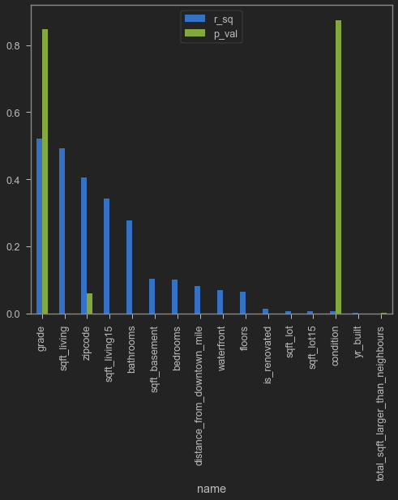
    


Here, I can spot some counter intuitive results as per common sense and domain knowledge. According to this `grade` and `condition` are not significant as those have very high p values. Where `grade` has good explaining power but `condition` does not. 

`zipcode` has 70 categories inside with varying params for each, thus it having high p values is understandable. 


<br>
Up next, I am looking at features isolated which might be causing this. Their combined effect can be much different. 


 

### Exploratory Multiple OLS a.k.a Multivariate OLS

 *Time for **multivariate** OLS!*

#### Iterative Model 1

With the insight of everything that I did before, I came with a bag of features for my multivariate model.


    Formula for the OLS model:  price ~ bedrooms + bathrooms + sqft_living + sqft_lot + floors + sqft_basement + yr_built + sqft_living15 + sqft_lot15 + distance_from_downtown_mile + C(waterfront) + C(condition) + C(grade) + C(is_renovated) + C(total_sqft_larger_than_neighbours) + C(zipcode)
    r_sq: 0.826
    


    
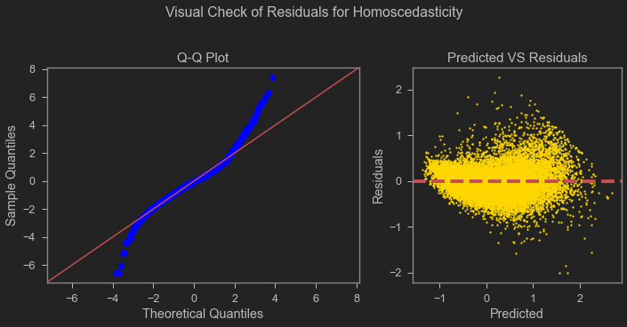
    


After all the features I dropped in this model from the base one, I have r square of 0.827, a little lower than before but the better than the  interim throw away model having 0.6519. I dropped `price_per_sqft` and added `zipcode`. Location has a huge impact on house price. So, I thought of having another location feature besides `distance_from_downtown_miles`. This is a better model. Also my QQ plots and residual plots are better than the base model, but worse than interim throw away model because of adding `zipcode`. `zipcode`'s can explain a lot but at the same time introduced noise. It is understandable because of the nature of the data. Houses in different `zipcode`'s have varying price with a general trend per zipcode but at the same time generally there are a good mix of houses with varying features in a zipcode.

`grade` has a high p value so I should drop this from the next iteration. Also dropped `yr_built`, was not expaining much. Leaving `sqft_lot15` for now.

#### Iterative Model 2


    Formula for the OLS model:  price ~ bedrooms + bathrooms + sqft_living + sqft_lot + floors + sqft_basement + sqft_living15 + distance_from_downtown_mile + C(waterfront) + C(condition) + C(is_renovated) + C(zipcode)
    r_sq: 0.8102
    


    
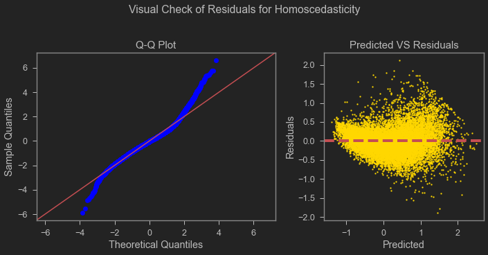
    


I don't have any features with high p values except some of the categories of `zipcode`. Out of 70 only 9 have this issue. So, I am going to leave this in for the final model. There is also a reduction of r square value. And residual plots are practically unchanged.
I could use the `grade` in the final model because of its impact on r square on some other days, for this analysis I am happy dropping it. 
<br>
This is my finally selected features.

___
I have searched for ideal bag of features using forward selection method, RFE and RFECV. None of them recommended me a better model, although managed to get a almost normal distribution of residuals by reducing the r squared to as low as .61. Those analysis can be found on the root of this repository named `student_detailed.ipynb`. I also did train-test split to check for over or under fitting and 2nd and 3rd degree polynomial regression in search of better r squared value in that notebook.
___
#### **Final model**

Lets use those selected features on unscaled `price` to be able to interpret the coeffs better. It is observed that, scaling has little to no impact on the outcome of the model.

Same analysis and interpretation as the above one as the model result did not see any change using unscaled `price`. Made me wonder, was scaling necessary or helpful for this analysis? It does, but very minimal. Not showing the results as they are mostly the same.

# iNTERPRET


This model can explain 81% of data indicated by r square. None of them have significant p value. No collinearity detected. 
Now looking at the betas I can see the relationships: 
___
| Feature |  beta  |  Relation  | Comment | Can Control? |
|-|-:|:-:|-|:-:|
| Intercept | 335799.05 |  positive  | Necessary to   facilitate regression. OLS line goes through this on the y-axis |  |
| sqft_living | 132496.68 |  positive  | Should increase it, very high beta | yes |
| is_renovated | 46199.95 |  positive  | Renovation has a good impact on the price | yes |
| waterfront | 345419.15 |  positive  | Waterfront house see a massive boost in the house | no |
| sqft_living15 | 38715.26 |  positive  |  | yes, indirectly |
| bathrooms | 16821.08 |  positive  | Add bathroom as it adds value | yes |
| sqft_lot | 12067.89 |  positive  | Higher the better, has positive impact | not really |
| floors | -9072.33 |  negative  | extra floors does not add much value unless offsetted by some other   feature | yes |
| bedrooms | -9275.87 |  negative  | extra bedrooms does not add much value unless offsetted by some other   feature | yes |
| sqft_basement | -24453.92 |  negative  | extra sqft here does not add much value unless offsetted by some other   feature | yes |
| distance_from_downtown_mile | -105340.49 |  negative  | Further you go from downtown, houses has lesser value | no |
| C(condition)[T.5.0] | 94578.71 |  positive  | Higher condition means better value | yes |
| C(condition)[T.4.0] | 62977.09 |  positive  | Higher condition means better value | yes |
| C(condition)[T.3.0] | 42254.24 |  positive  | Higher condition means better value | yes |

More nuanced analysis can be done on `floors`, `bedroom` and `sqft_basement` by considering them as categorical data for inference and provide explicit recommendation. Those could also be binned. Condition less than 3 were dropped in the outlier remeval process.

zipcodes has varying impact on the house value depending on which zipcode it is. The take away is zipcodes have strong relation with the price. Some are positive some are negative. Negative ones can expect less value. 
___
| Zipcodes | Beta | Relation |
|-|:-:|-|
| 98039 | 455084.03 | positive |
| 98004 | 362286.19 | positive |
| 98112 | 261271.39 | positive |
| 98040 | 259455.47 | positive |
| 98119 | 258799.06 | positive |
| 98109 | 257002.13 | positive |
| 98102 | 247550.35 | positive |
| 98105 | 230676.59 | positive |
| 98199 | 208969.15 | positive |
| 98053 | 198417.47 | positive |
| 98029 | 193993.07 | positive |
| 98005 | 188249.92 | positive |
| 98045 | 186074.31 | positive |
| 98033 | 184085.66 | positive |
| 98107 | 183802.17 | positive |
| 98117 | 183437.24 | positive |
| 98103 | 182682.27 | positive |
| 98115 | 178326.06 | positive |
| 98075 | 166391.60 | positive |
| 98027 | 162088.94 | positive |
| 98052 | 155003.58 | positive |
| 98006 | 152705.06 | positive |
| 98116 | 148814.95 | positive |
| 98074 | 146855.53 | positive |
| 98022 | 144307.59 | positive |
| 98065 | 138944.82 | positive |
| 98122 | 137847.61 | positive |
| 98008 | 134675.27 | positive |
| 98024 | 134383.22 | positive |
| 98007 | 131599.48 | positive |
| 98136 | 126022.79 | positive |
| 98077 | 125642.74 | positive |
| 98010 | 120318.14 | positive |
| 98014 | 109883.72 | positive |
| 98177 | 102135.16 | positive |
| 98072 | 73509.44 | positive |
| 98034 | 71763.06 | positive |
| 98125 | 67925.08 | positive |
| 98144 | 64782.45 | positive |
| 98019 | 63135.63 | positive |
| 98126 | 49323.28 | positive |
| 98011 | 46363.11 | positive |
| 98038 | 41583.86 | positive |
| 98133 | 37155.57 | positive |
| 98155 | 36122.91 | positive |
| 98028 | 26184.43 | positive |
| 98002 | 18727.78 | positive |
| 98118 | 8518.02 | positive |
| 98003 | 7354.71 | positive |
| 98092 | 538.06 | positive |
| 98023 | -4601.84 | negative |
| 98070 | -5941.64 | negative |
| 98042 | -7492.64 | negative |
| 98166 | -9331.88 | negative |
| 98059 | -18538.94 | negative |
| 98198 | -19427.77 | negative |
| 98056 | -19863.63 | negative |
| 98030 | -28292.89 | negative |
| 98146 | -28929.26 | negative |
| 98106 | -35205.07 | negative |
| 98058 | -37175.44 | negative |
| 98032 | -37593.16 | negative |
| 98148 | -41163.22 | negative |
| 98031 | -45656.11 | negative |
| 98108 | -47959.54 | negative |
| 98055 | -51645.43 | negative |
| 98188 | -63133.71 | negative |
| 98178 | -73196.63 | negative |
| 98168 | -88167.59 | negative |


___


Note: 
- If the beta coefficient is positive, the interpretation is that for every 1-unit increase in the predictor variable, the outcome variable will increase by the beta coefficient value, and vice versa.
- one category is lost from each categorical variable, unable to capture its impact on price by looking into its beta.
___


Q-Q plot of residuals looks good, but the scatter plot is messy, indicating some bias. This is because of the nature of the data.
<br>
<br>
Harsh outlier removal has impact on the result.


This is better from the base model, with every thing except r squared. But the base model failed in everything except that, did not even satisfy some assumptions for linar regression.

Adding more feature has a direct relation with r square. And leaving more outliers has a impact on the residuals distribution. One of the core assumptions of liner regression. Liner regression for this type of data alright, it tries to predict a specific price. In real life for this type of property use of range rather than accuracy maybe more appropriate, depending on the use case. There are a lot of models out there for prediction. For that range calculation maybe a tree based model is better or even classification. Liner regression is a widely use technique for prediction of price. 

# RECOMMENDATIONS & CONCLUSIONS

Homeowners should focus to:
<br>
* Condition of the house is important. Invest on improving elements that improves that. Focus on higher quality building materials.
* Try to increase sqft living; consider adding to the property.
* Should expect more value if closer to the city
* Grade provided by the city is important. Read the guidelines and do things that improve grade. Like better materials
* Dont be a outlier in the neighborhood in terms of living space. At least remodel to match that.
* lot size also matters. try to strike a perfect balance here.
* Bedrooms after 5 has a diminishing return. Do not focus on increasing. Instead invest on creating a better condition.
* Basement sqft has a negative relation with value. Focus else where.
* Renovation has a positive impact on price.
* Old houses sells for less. If house is old then try to get better grade and condition for better value.


Then they can observe a substantial improvement of their house value.

<h1 style ="background-color:green; color:white"> Appendix </h1>

## Where to find notebook

Notebook accompanying this analysis can be found in in the root of the repository named `student.ipynb`. A pdf version is also there. For the detailed one with additional work check `student_detailed.ipynb`. Presentation for this is also in the root named `presentation.pptx` with a pdf version `presentation.pdf`. All the data is inside `/Data/` folder, labeled appropriately.


## Next Steps 

I would like to, in no particular order:

- Data collecting
 - try a model with unscaled dependent variable; price and see the impact on model performance. That will help me better explain the data. But if not reporting those the the sign alone is enough. 
 * engineered more features. e.g. total house sqft, bedroom to bathroom ratio.
 * process date as year, or split it to year and month and try to capture seasonality of value on listing timing.
 * bin some features. e.g. year built by decades or something; bedrooms in single, typical, and large.
 * make some boolean features. e.g. has basement.
 * get some other monetary (e.g. average property price), and cultural and recreational (e.g. proximity to some stadium, local restaurant density, public transport, schools, parks) info about the locations. I am not sure how to get all those info.
 * get some more info about view and include in the analysis. LOCATION does matter in the real estate business.

- Modeling
 * try another method for RFE. e.g. tree based - random forest. RFECV - Recursive Feature Elimination with Cross Validation.
 * use cross validation a.k.a. rotation estimation. e.g. k-fold cross-validation, Repeated random sub-sampling validation a.k.a. Monte Carlo Simulation.
 * make train-test split and compare predictive power.
 * use some other metric other than r square. e.g. RMSE, p value, coefficients.
 * try other features in in model. go for an exhaustive search. 


